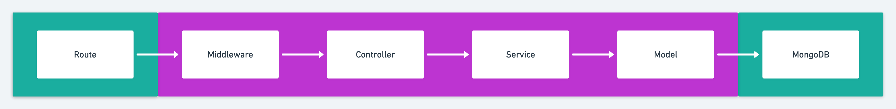

# Projeto Full Stack

## Descrição

Este projeto consiste em dois desafios separados: um para o **backend** e outro para o **frontend**. Cada um deles é independente e executa de forma isolada, sem uma vinculação direta entre si. O **backend** oferece uma API RESTful, enquanto o **frontend** consome dados de uma API externa.

## Estrutura do Projeto

- **Backend**: Roda na porta `3001`
- **Frontend**: Roda na porta `3000`

## Backend

O backend é construído usando mongoose, express e outras tecnologias.

Fluxo de dados:


### Documentação da API

A documentação completa da API pode ser acessada em:

[http://localhost:3001/api-docs/#/](http://localhost:3001/api-docs/#/)

### Como Rodar o Backend

1. Navegue até o diretório do backend:
   ```sh
   cd backend
   ```
2. Instale as dependências:
   ```sh
   npm install
   ```
3. Inicie o servidor:
   ```sh
   npm run dev
   ```
4. O backend estará disponível em [http://localhost:3001](http://localhost:3001).

## Frontend

O frontend é construído usando Next.js, React e outras tecnologias.

### Como Rodar o Frontend

1. Navegue até o diretório do frontend:
   ```sh
   cd frontend
   ```
2. Instale as dependências:
   ```sh
   npm install
   ```
3. Inicie o servidor de desenvolvimento:
   ```sh
   npm run dev
   ```
4. O frontend estará disponível em [http://localhost:3000](http://localhost:3000).
